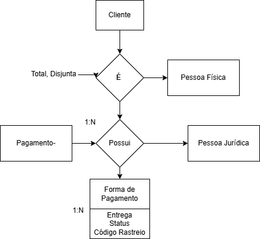

# Modelo Conceitual - Sora Video Editor V3 🛒

Projeto de modelagem conceitual de um banco de dados para a aplicação de edição de vídeo Sora.

## 📌 Entidades e Relacionamentos

- **Cliente**: pode ser **Pessoa Física** ou **Pessoa Jurídica**.
- **Pagamento**: relacionado à **Forma de Pagamento**, com informações de **entrega**, como status e código de rastreio.
- Relacionamentos com cardinalidade e especialização (total e disjunta).

## 🧩 Arquivos no repositório

- `sora_video_editor_v3.drawio`: diagrama editável feito no Draw.io
- `sora_video_editor_v3.png`: imagem do modelo para visualização rápida

## 🛠️ Ferramentas utilizadas

- Draw.io (diagramação)
- GitHub (armazenamento)

---

🧠 *Esse modelo pode ser base para implementação futura de um banco relacional (DER e scripts SQL).*
---

### 📌 Modelo Conceitual Visual

